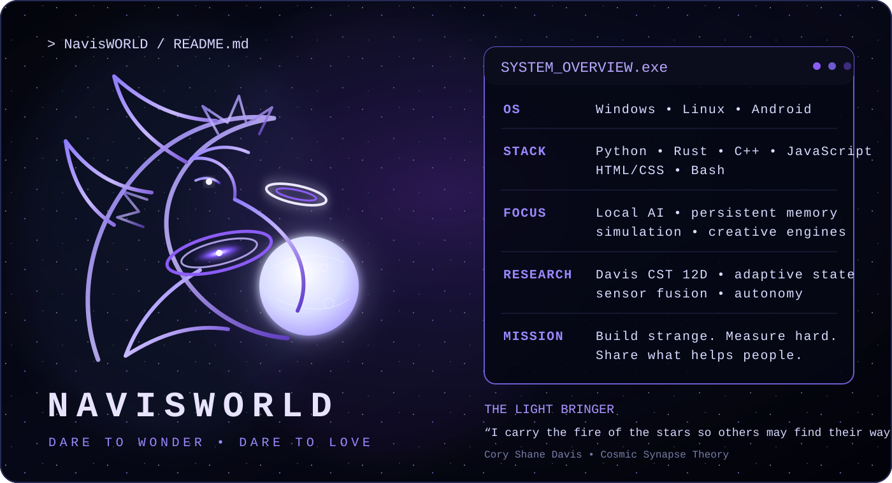

# NAVISWORLD
### CORY SHANE DAVIS • COSMIC SYNAPSE THEORY • BUILDER • RESEARCHER • CREATOR

**DARE TO WONDER ✦ DARE TO LOVE**

---

## About Me

I build because I love creating.

That means **AI, software, music, art, research, electronics, educational tools, and systems that live somewhere between engineering and wonder**.

At the center of much of my work is **Cosmic Synapse Theory (CST)**, a computational research direction exploring **multidimensional state, memory, recurrence, learned association, signal-driven dynamics, and coupled systems**.

I care about building things people can **run, question, learn from, improve, or prove wrong**.

---

## Core Worlds

- **COSMOS**
- **CST**
- **ZEREF**
- **Reality Bridge**
- **GENESIS**
- **Universe Manual**
- **Python CST Libraries**
- **QC67_cosmo**

---

## Current Focus

- local-first AI systems  
- persistent memory and state  
- autonomous tooling  
- simulations and creative engines  
- educational tools  
- giving back through open knowledge  

---

## Support Cosmic Synapse

If my work inspired you, helped you, or made you wonder:

### ☕ [buymeacoffee.com/cosmic_syanpse](https://buymeacoffee.com/cosmic_syanpse)

---

## THE UNIVERSE IS THE SOFTWARE. ✦ WE JUST WRITE BETTER INTERFACES.

