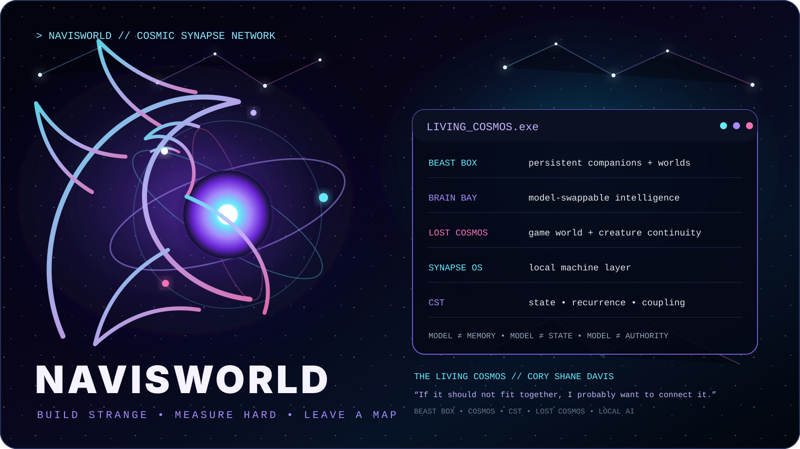
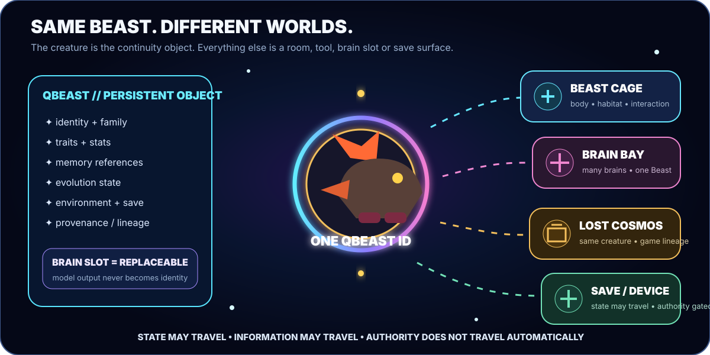
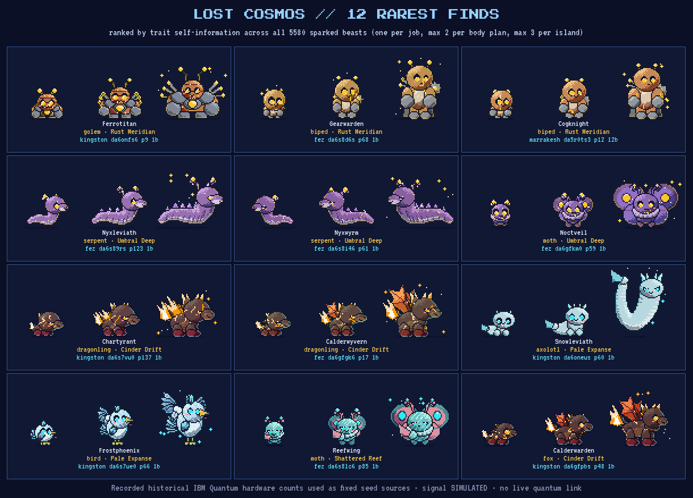
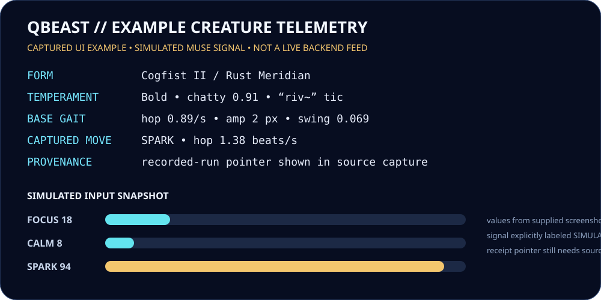
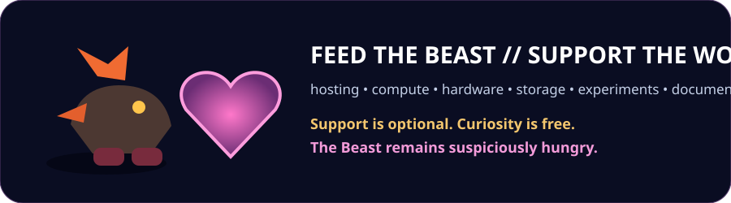
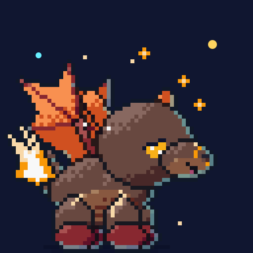

<div align="center">



# CORY SHANE DAVIS // NAVISWORLD

### 🐉 BEAST BOX • 🌌 COSMOS • ⚛️ COSMIC SYNAPSE THEORY • 🎮 LOST COSMOS • 🧠 LOCAL AI • 🛰️ SYNAPSE OS

**Independent builder / researcher / creator making persistent software creatures, local-first AI, games, simulation, devices, art and evidence connect into one universe.**

[](https://www.beastboxcosmos.xyz)
[](https://github.com/NavisWORLD/The-beast-box-)
[](https://github.com/sponsors/NavisWORLD)
[](https://buymeacoffee.com/Cosmic_syanpse)

### ✦ BUILD STRANGE • MEASURE HARD • LEAVE A MAP ✦

</div>

---

## `01 // ENTER_THE_LIVING_COSMOS`

Welcome to the weird part of GitHub.

I build things that usually begin with:

> **Okay, but what if these systems were actually connected?**

The flagship is **[Beast Box](https://github.com/NavisWORLD/The-beast-box-)**: a local-first software ecosystem for persistent digital companions. The creature carries identity and state outside the inference model so the model can change without automatically erasing the creature's continuity.

**The short version:**

> **MODEL ≠ MEMORY ≠ STATE ≠ AUTHORITY**

A Beast can use a model. A Beast is not the model.

<div align="center">

### 🐉 [OPEN THE LIVE BEAST BOX →](https://www.beastboxcosmos.xyz)

**CREATE → SEE → HEAR → INTERACT → TALK → SIMULATE → EVOLVE → EXPLORE → PERSIST**

</div>

---

## `02 // ONE_CREATURE — MANY_WORLDS`



**ONE CREATURE • MANY BRAINS • MANY WORLDS • CONTINUOUS IDENTITY**

The creature is the continuity object. The surfaces are rooms it can visit.

```text
CREATURE
│
├── identity + family
├── traits + stats
├── memory references
├── evolution state
├── environment + save state
├── QBEAST metadata / provenance
│
└── MODEL SLOT
      ├── RAWRPHØS / local research paths
      ├── local models
      └── supported external provider adapters

BEAST → BEAST CAGE → BRAIN BAY → LOST COSMOS → EXPORT / SAVE / DEVICE
```

**State may travel. Information may travel. Authority does not travel automatically.**

That boundary is not lore. It is the engineering rule.

---

## `03 // THE_WORKSHOP`

<table>
<tr>
<td width="50%" valign="top">

### 🛠️ Builder desk

The boring machinery is part of the magic:

`git` • source history • tests • CI • local development • reproducible artifacts • receipts • failed runs kept when they teach something

**Rule:** build → instrument → test → preserve → connect → teach → ship.

</td>
<td width="50%" valign="top">

### 🐉 Beast habitat

The creative layer is allowed to be ridiculous.

The technical layer still has to answer:

- what state exists,
- where it lives,
- who may change it,
- what was measured,
- what was simulated,
- and which receipt proves the sentence.

</td>
</tr>
</table>

> **probably should not connect these — connected them anyway**

---

## `04 // BEAST_BOX // THE_CENTER_SHELF`

**Beast Box** is the place where the separate threads become one product surface:

| Room | What it does |
|---|---|
| 🐉 **Beast Cage** | Creature body, visual state, habitat and interaction. |
| 🧠 **Brain Bay** | Connects the creature to supported local/native/external inference paths without making the model the identity. |
| 🎮 **Lost COSMOS** | Game surface where a serialized creature can become a playable snapshot. |
| 🧬 **Genesis / Spark systems** | Seeded creature creation, traits, stats, visuals and provenance-aware generation. |
| 💾 **Persistence** | Save/load, memory references, lineage, serialized state and recovery. |
| 🪽 **Sensory / device experiments** | Permission-controlled browser sensing and future companion-device surfaces. |

**[Source →](https://github.com/NavisWORLD/The-beast-box-)** ·
**[Live experience →](https://www.beastboxcosmos.xyz)**

---

## `05 // MODEL_GARDEN`



The garden is intentionally honest about status. A name, adapter, checkpoint or research artifact does not magically turn every identity into an equally capable production model.

- **RAWRPHØS** — native/local research line documented inside the Beast Box ecosystem.
- **PHOS** — NavisWORLD research model identity; artifacts do not imply production readiness.
- **SAMGO** — NavisWORLD model-family identity.
- **MUSE** — model/assistant identity; separate from the **Muse EEG/headband connector** discussed elsewhere.
- **SOL** — ecosystem model/assistant identity; capability claims stay scoped to the actual artifact using the name.

None of those labels assigns PHOS or SAMGO to another company.

---

## `06 // LOST_COSMOS // THE_GAME_BOY_SHRINE`

<table>
<tr>
<td width="58%" valign="top">



</td>
<td width="42%" valign="top">

### Same creature, another surface

Lost COSMOS is the game-facing side of the ecosystem.

The captured interface at left shows:

**Cogfist II / Rust Meridian**

`SPARK` movement · generated gait / reaction parameters · local-model option · a recorded-run pointer

The input panel is explicitly labeled **SIMULATED MUSE SIGNAL**. It is not a live EEG measurement in this capture.

**yes, it actually has save data**

</td>
</tr>
</table>

<details>
<summary><b>🗺️ Open a supplied 12-creature atlas</b></summary>
<br/>

<br/><br/>
The poster is a supplied project artifact. Its rarity labels and body-plan labels are presented as part of that artifact rather than independently re-derived here.
</details>

---

## `07 // CREATURE_METRICS // RECEIPT_ATTACHED`



This card is **EXAMPLE CREATURE TELEMETRY**, reconstructed from a supplied UI capture — not a public live endpoint.

The important pattern is less flashy than the bars:

> **displayed state should always say where it came from.**

If the source is simulated, say simulated. If it is seeded, say seeded. If it is measured, keep the receipt that makes *measured* a defensible word.

---

## `08 // CST_OBSERVATORY`

### ⚛️ Cosmic Synapse Theory

CST is the research shelf: recurrence, coupling, compact computational state, memory, signal, association, perturbation, ablation and falsifiable software experiments.

I use **12D** as computational-state notation in parts of this work. That is a description of a software state vector unless a separate experiment establishes something more.

<details>
<summary><b>🔬 SCIENTIFIC BOUNDARY // LIGHTS ON</b></summary>
<br/>

A computational `12D` state does **not** by itself prove twelve physical dimensions, consciousness, a neural universe, or a new law of physics.

Continuity does **not** establish consciousness.

Visualization does **not** establish an experiment.

Seeded generation does **not** become a hardware measurement because the UI looks quantum.

The software can be real while a broader interpretation remains a hypothesis.

</details>

**[CST origin →](https://github.com/NavisWORLD/The-theory-of-CST)** ·
**[Deposited record →](https://doi.org/10.5281/zenodo.17574447)**

---

## `09 // QUANTUM_AND_SIMULATION_BENCH`

The bench has four labeled drawers because mixing them destroys trust.

| Label | Meaning |
|---|---|
| **SIMULATOR** | Classical simulator output, including QVM-style workflows. |
| **SEEDED** | Deterministic/pseudorandom input or a fixed recorded artifact reused as a seed. |
| **MEASURED** | A stored measurement artifact whose provider/backend/run context is preserved. |
| **HARDWARE / QPU** | Claimed only when the receipt actually identifies a hardware backend/job and the measurement record is retained. |

Recorded measurement outcomes become ordinary classical data once stored. They can seed software; they do not create an ongoing entanglement or live quantum link to a creature.

**null results live here too**

---

## `10 // SYNAPSE_OS + DEVICE_LAB`

The creature should not be trapped in one webpage.

Current and future-facing surfaces include browser/local runtime work, **[Synapse OS](https://github.com/NavisWORLD/Synapse-os-)**, native GBA/game-pack work, and device concepts.

The safe device idea is intentionally boring under the magic:

```text
WATCH / HANDHELD / PUCK
        │
        │ small public snapshot + input events
        ▼
PHONE / LOCAL HOST
        │
        ├── creature ledger + save
        ├── policy / permissions
        └── optional model inference
```

A watch can render the creature, display status, accept taps and send bounded events without storing the whole memory vault or model. That makes the *same companion on a watch* plausible without pretending the watch contains the entire Beast Box.

**Custom hardware remains a concept until a real prototype earns stronger language.**

---

## `11 // CURRENT_SIGNAL`

```text
FLAGSHIP     Beast Box
CREATURE     Spark Beast / QBEAST identity
GAME         Lost COSMOS
RESEARCH     CST
NATIVE LINE  RAWRPHØS
STATE        persistent / portable
OS TRACK     Synapse OS
METHOD       build → instrument → test → preserve
MISSION      connect weird systems without lying about the seams
```

The product direction is companion-first, world-second: continuity across surfaces is the thing worth protecting. The broader plan treats model memory and creature identity as separate concerns.

---

## `12 // PROJECT_CONSTELLATION`

| Portal | Signal |
|---|---|
| 🐉 **[THE BEAST BOX](https://github.com/NavisWORLD/The-beast-box-)** | Persistent creatures, Beast Cage, Brain Bay, Lost COSMOS, model integration, persistence, simulation and exports. |
| 🌌 **[COSMOS](https://github.com/NavisWORLD/Cosmos)** | Local-first runtime engineering around state, tools, memory, evaluation and portable intelligence. |
| ⚛️ **[COSMIC SYNAPSE THEORY](https://github.com/NavisWORLD/The-theory-of-CST)** | Recurrence, coupling, computational state, association, simulation and falsifiable experiments. |
| 💻 **[SYNAPSE OS](https://github.com/NavisWORLD/Synapse-os-)** | OS-level experiments bringing local AI and Beast Box concepts closer to the machine. |
| 🎵 **[REALITY BRIDGE / ALIEN CONDUCTOR](https://github.com/NavisWORLD/-reality-bridge-alien-conductor-local-ai-band)** | Realtime music, adaptive accompaniment and shared musical state. |
| 🪐 **[LIVING UNIVERSE](https://github.com/NavisWORLD/Cosmic-synapse-the-living-universe-sim-engine-)** | World-state, simulation, visualization and interactive CST-inspired systems. |
| 🧬 **[PYTHON CST LIBRARIES](https://github.com/NavisWORLD/Python-cst-libraries-)** | Reusable state, simulation and CST engineering primitives. |
| 📖 **[COSMOS / CST MANUAL](https://github.com/NavisWORLD/Volume-I-The-COSMOS-CST-Universe-Manual.)** | Public theory maps, engineering notes, education and documentation. |
| 🎨 **[COSMOS MEDIA](https://github.com/NavisWORLD/Cosmic-quantum-video-picture-generator-)** | Image, video, storybook continuity and generative-media experiments. |
| 🫀 **[HEARTLIGHT](https://github.com/NavisWORLD/COSMOS-HEARTLIGHT)** | Accessibility-oriented and human-centered technology experiments. |

<div align="center">

### [ENTER THE FULL REPOSITORY UNIVERSE →](https://github.com/NavisWORLD?tab=repositories)

</div>

---

## `13 // CREATOR_LOOP`

<table>
<tr>
<td width="50%" valign="top">

### `WHO_AM_I.exe`

```text
NAME       Cory Shane Davis
HANDLE     NavisWORLD

MODE       creator / builder
           independent researcher

MATERIAL   code • games • models
           electronics • music
           art • writing • experiments

RULE       curiosity > certainty
```

</td>
<td width="50%" valign="top">

### `WORKSHOP_RULES.txt`

```text
measure what matters
keep the failed receipt
separate model from state
separate state from authority
make it understandable
make it strange anyway
```

</td>
</tr>
</table>

<details>
<summary><b>🧪 Open creator mode</b></summary>

```python
while curiosity:
    artifact = build(ask_the_question_no_one_asked())
    instrument(artifact)
    test(artifact)

    preserve(
        wins=True,
        failures=True,
        null_results=True,
        receipts=True,
    )

    connect(artifact, to="the rest of the universe")
    teach(what_we_learned)
    ship(what_is_real)
```

</details>

---

## `14 // FEED_THE_BEAST`



<div align="center">

### 💖 [GITHUB SPONSORS](https://github.com/sponsors/NavisWORLD)
### ☕ [BUY ME A COFFEE](https://buymeacoffee.com/Cosmic_syanpse)

**Support adds:** hosting · compute · hardware · storage · experiments · documentation · prototype parts · development time

**No fake counters. No fake scarcity. No pretending sponsorship buys scientific truth.**

*Support is optional. Curiosity is free. The Beast remains suspiciously hungry.*

</div>

---

## `15 // OPEN_SOURCE + LICENSING`

Original Cory-owned content published with the [Apache-2.0 LICENSE](LICENSE) is available under that license except where files, repositories, model weights, datasets, artwork or third-party dependencies state otherwise.

**[Open-source scope →](OPEN_SOURCE_SCOPE.md)** ·
**[Verified ecosystem licensing inventory →](OPEN_SOURCE_ECOSYSTEM.md)**

The profile itself is a map, not a relicensing machine. Individual repositories and artifacts keep their own stated terms.

---

## `16 // FINAL_TRANSMISSION`

<div align="center">



# `THE UNIVERSE IS THE SOFTWARE.`
## `WE JUST WRITE BETTER INTERFACES.`

**For the dreamers.**  
**For the idlers.**  
**For the players.**  
**For the builders.**  
**For the researchers.**  
**For anybody curious enough to press the glowing button.**

🌌 🐉 ⚛️ 🎮 🧠 🛰️ ❤️

### CORY SHANE DAVIS // NAVISWORLD

[BEAST BOX](https://www.beastboxcosmos.xyz) •
[SOURCE](https://github.com/NavisWORLD/The-beast-box-) •
[GITHUB SPONSORS](https://github.com/sponsors/NavisWORLD) •
[BUY ME A COFFEE](https://buymeacoffee.com/Cosmic_syanpse) •
[ALL REPOSITORIES](https://github.com/NavisWORLD?tab=repositories)

</div>