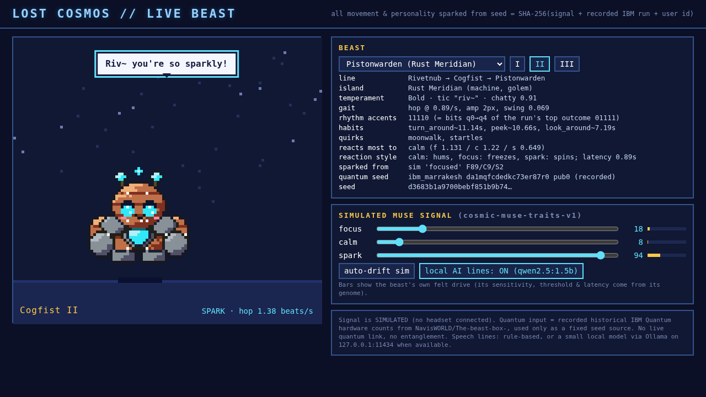
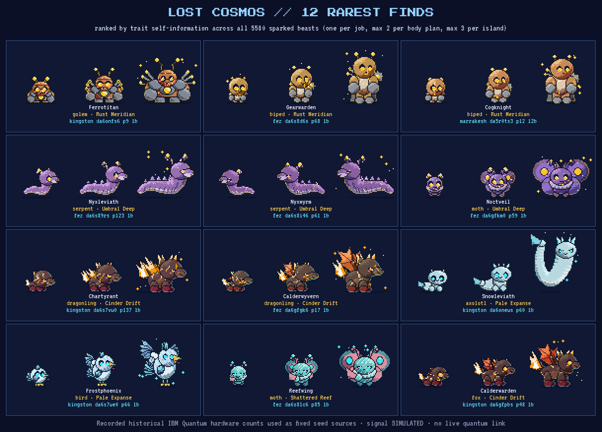
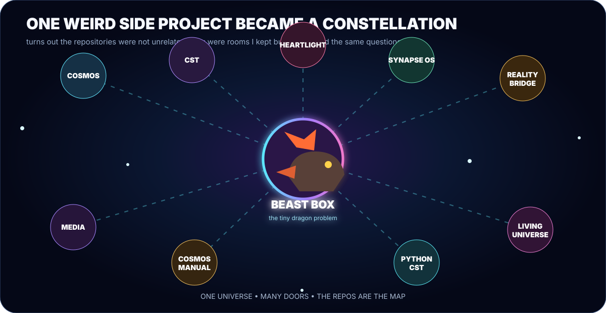

<div align="center">

<picture>
  <source media="(max-width: 600px)" srcset="assets/light-bringer-mobile.svg" />
  
</picture>

<h2>CORY SHANE DAVIS // NAVISWORLD</h2>

<p><strong>🐉 Beast Box — persistent computational companions.</strong><br />One creature. Many brains. Many worlds.</p>

<p>🌌 COSMOS · ⚛️ CST · 🎮 Lost COSMOS · 🧠 Local AI · 🛰️ Synapse OS</p>

<p><a href="https://www.beastboxcosmos.xyz"></a> <a href="https://github.com/NavisWORLD/The-beast-box-"></a> <a href="https://github.com/sponsors/NavisWORLD"></a> <a href="https://buy.stripe.com/3cIbJ27zN7kO8mN97pa7C01"></a></p>

<sub>✦ BUILD STRANGE · MEASURE HARD · LEAVE A MAP ✦</sub>

</div>

---

## 🌌 Welcome to the weird part of GitHub

I build persistent software creatures and the systems around them.

The big idea is simple:

> **The creature is the continuity object. Models are brains. Games are worlds. Devices are bodies.**

Instead of treating one inference model as the entire identity, **[Beast Box](https://github.com/NavisWORLD/The-beast-box-)** keeps creature identity and persistent state separate enough that models, runtimes and worlds can change without automatically becoming a new creature.

**MODEL ≠ MEMORY ≠ STATE ≠ AUTHORITY**

**MODEL ≠ IDENTITY**, too: a Beast can use a model without becoming that model.

<div align="center">

**CREATE → SEE → HEAR → INTERACT → TALK → PLAY → SIMULATE → EVOLVE → PERSIST**

[**OPEN THE LIVE BEAST BOX →**](https://www.beastboxcosmos.xyz)

</div>

---

## 🐉 Same Beast. Different Worlds.

<picture>
  <source media="(max-width: 600px)" srcset="assets/cosmos-core-mobile.svg" />
  
</picture>

**ONE CREATURE · MANY BRAINS · MANY WORLDS · CONTINUOUS IDENTITY**

The creature is the continuity object. The surfaces are rooms it can visit.

- **Identity** — family, lineage, stable creature identity
- **State** — traits, stats, evolution, environment and save state
- **Memory references** — kept distinct from model weights
- **Provenance** — QBEAST and experiment-source metadata where applicable
- **Brain slot** — replaceable model/runtime path

**State may travel. Information may travel. Authority does not travel automatically.**

That boundary is not lore. It is the engineering rule.

<details>
<summary><b>🧬 Open the continuity structure</b></summary>
<br/>

```text
CREATURE
│
├── identity + family
├── traits + stats
├── memory references
├── evolution state
├── environment + save state
├── QBEAST metadata / provenance
│
└── BRAIN SLOT
      ├── RAWRPHØS / PHOS / SAMGO / QC67
      ├── COSMIC.CYPHER local-model routing
      ├── compatible local models
      └── supported provider adapters

BEAST → BEAST CAGE → BRAIN BAY → LOST COSMOS → SAVE / EXPORT / DEVICE
```

</details>

---

## 👹 Beast Box, without the 47-tab explanation

**Beast Box** is the integration surface where the research becomes something a normal person can actually touch.

- 🧬 **Genesis / Spark** — create the creature, seed its traits and establish provenance-aware identity.
- 🐉 **Beast Cage** — body, habitat, care, interaction and visible creature state.
- 🧠 **Brain Bay** — connect supported brains without making a model the creature.
- 🎮 **Lost COSMOS** — let the same serialized creature enter a game world.
- 💾 **Persistence** — save, load, export, recover and preserve lineage.
- 🪽 **Device experiments** — explore how the same companion might inhabit smaller or native surfaces.

**[Live experience →](https://www.beastboxcosmos.xyz)** · **[Source →](https://github.com/NavisWORLD/The-beast-box-)**

> *Basically: one tiny creature survives my terrible habit of putting it in increasingly unreasonable places.*

---

## 🧠 The cosmic brain menagerie

<picture>
  <source media="(max-width: 600px)" srcset="assets/model-garden-mobile.svg" />
  
</picture>

Not every cosmic name in this ecosystem is the same kind of thing. 💀

### Actual NavisWORLD model work

- **RAWRPHØS** — native/local Beast Box research line.
- **PHOS** — experimental published model work.
- **SAMGO** — experimental model-family work.
- **QC67 / COSMOS-Zeref lineage** — published/local lineage used by the Zeref kit, kept separate from broader creature memory/state.

### COSMIC.CYPHER

**COSMIC.CYPHER is not another model checkpoint.** It is a local-model registry, conversation layer and bounded coding-agent interface.

Another model can become a Beast Box brain **if it can be wrapped by a compatible Brain Bay adapter**.

**Nebula** remains creature/world/visual identity language in this ecosystem; it is **not a deployed language-model checkpoint**.

The important rule is still boring on purpose:

> **The model is a brain slot. The Beast is the continuity object.**

<details>
<summary><b>🔌 How Brain Bay plugs a brain in</b></summary>
<br/>

```text
QBEAST IDENTITY
      │
      ▼
BRAIN BAY
      │
      ├── choose model / runtime
      ├── provide bounded creature context
      ├── send an allowed inference request
      ├── receive normalized response + source metadata
      └── return control to the Beast state layer

MODEL OUTPUT ≠ CREATURE IDENTITY
MODEL CONTEXT ≠ OWNER MEMORY VAULT
MODEL ACCESS ≠ AUTHORITY
```

Current documented local paths include `Ollama`, `GGUF`, `llama.cpp server`, and loopback OpenAI-compatible runtimes such as LM Studio.

[**Open COSMIC.CYPHER docs →**](https://github.com/NavisWORLD/The-beast-box-/blob/main/docs/COSMIC_CYPHER.md)

</details>

---

## 🎮 Then I put the little menace in a Game Boy


**Same Beast. Different world. Now it has a save file.** 💀

Lost COSMOS is the game-facing side of the system: a place where a serialized creature can become playable without pretending the game character is an unrelated identity.

The supplied capture includes **simulated** input controls. It is not presented as a live EEG measurement.

<details>
<summary><b>🗺️ Open the actual interface capture + creature atlas</b></summary>
<br/>
The handheld scene above is artwork. These are the original creator-supplied software captures; open an image to inspect its full-size text.



</details>

---

## 📡 Creature state should say where it came from


This is **EXAMPLE CREATURE TELEMETRY**, not a claim of a live public backend feed.

The scanner shows simulated inputs from the supplied Cogfist capture: **focus 18 · calm 8 · spark 94**. The guide is artwork; those values are not its live stats.

If state is **simulated**, say simulated. If it is **seeded**, say seeded. If it is **measured**, keep the receipt that makes *measured* defensible.

---

## ⚛️ The actual research shelf

### Cosmic Synapse Theory



CST is where I explore recurrence, coupling, compact computational state, memory, signal, association, perturbation, ablation and falsifiable software experiments.

I use **12D** as computational-state notation in parts of this work. That means a software state vector unless a separate experiment establishes something more.

<details>
<summary><b>🔬 Scientific boundary — lights on</b></summary>
<br/>

A computational `12D` state does **not** by itself prove twelve physical dimensions, consciousness, a neural universe or a new law of physics.

Continuity does **not** establish consciousness. Visualization does **not** establish an experiment. Seeded generation does **not** become a hardware measurement because the interface looks quantum.

The software can be real while a broader interpretation remains a hypothesis.

</details>

**[CST repository →](https://github.com/NavisWORLD/The-theory-of-CST)** · **[Deposited record →](https://doi.org/10.5281/zenodo.17574447)**

### Quantum work — with the labels left on



I keep these categories separate because mixing them destroys trust:

- **SIMULATOR** — classical simulator output, including QVM-style workflows.
- **SEEDED** — deterministic/pseudorandom input or a recorded artifact reused as a seed.
- **MEASURED** — stored measurement data with provider/backend/run context preserved.
- **HARDWARE / QPU** — used only when the retained receipt actually identifies hardware execution.

*QPU\* in the artwork: hardware label only when provenance earns it. QVM ≠ QPU.*

Recorded measurement results become ordinary classical data once stored. They can seed software; they do not create an ongoing quantum link to a creature.

**Null results live here too.**

---

## 🛰️ The creature should not be trapped in one webpage



Current and future-facing surfaces include browser/local runtime work, **[Synapse OS](https://github.com/NavisWORLD/Synapse-os-)**, native GBA/game-pack work, and device concepts.

The intended direction is simple:

**same companion → different body → bounded state exchange → same identity**

A smaller device does not need the whole memory vault or full model runtime. It can display the creature, accept bounded input and synchronize through a more capable local host.

**Custom hardware remains a concept until a real prototype earns stronger language.**

---

## 🌌 Project constellation



Turns out “one weird side project” became a whole constellation. Who could have predicted this. *(Me. Eventually.)*

- 🐉 **[The Beast Box](https://github.com/NavisWORLD/The-beast-box-)** — persistent creatures, models, games, persistence and exports.
- 🌌 **[COSMOS](https://github.com/NavisWORLD/Cosmos)** — state, tools, memory, evaluation and portable-intelligence engineering.
- ⚛️ **[Cosmic Synapse Theory](https://github.com/NavisWORLD/The-theory-of-CST)** — recurrence, coupling, computational state and falsifiable experiments.
- 💻 **[Synapse OS](https://github.com/NavisWORLD/Synapse-os-)** — OS-level local-AI and Beast Box experiments.
- 🎵 **[Reality Bridge / Alien Conductor](https://github.com/NavisWORLD/-reality-bridge-alien-conductor-local-ai-band)** — realtime music and shared musical state.
- 🪐 **[Living Universe](https://github.com/NavisWORLD/Cosmic-synapse-the-living-universe-sim-engine-)** — world-state and simulation experiments.
- 🧬 **[Python CST Libraries](https://github.com/NavisWORLD/Python-cst-libraries-)** — reusable simulation and state primitives.
- 📖 **[COSMOS / CST Manual](https://github.com/NavisWORLD/Volume-I-The-COSMOS-CST-Universe-Manual.)** — public maps, notes and documentation.
- 🎨 **[COSMOS Media](https://github.com/NavisWORLD/Cosmic-quantum-video-picture-generator-)** — image, video and generative-media experiments.
- 🫀 **[Heartlight](https://github.com/NavisWORLD/COSMOS-HEARTLIGHT)** — accessibility-oriented and human-centered experiments.

<div align="center">

[**ENTER THE FULL REPOSITORY UNIVERSE →**](https://github.com/NavisWORLD?tab=repositories)

</div>

---

## 🧠 Cory.exe



```text
NAME       Cory Shane Davis
HANDLE     NavisWORLD
MODE       creator / builder / independent researcher
MATERIAL   code · games · models · electronics · music · art · writing
RULE       curiosity > certainty
METHOD     build → instrument → test → preserve → connect → teach → ship
```

<details>
<summary><b>🧪 Open creator mode</b></summary>
<br/>

```python
while curiosity:
    artifact = build(ask_the_question_no_one_asked())
    instrument(artifact)
    test(artifact)
    preserve(wins=True, failures=True, null_results=True, receipts=True)
    connect(artifact, to="the rest of the universe")
    teach(what_we_learned)
    ship(what_is_real)
```

</details>

---

## 🐉 Feed the Beast


I somehow made the dragon require server bills. Incredible.

Support helps with **hosting, compute, storage, hardware, experiments, documentation, prototype parts and development time.**

- 💖 **[GitHub Sponsors](https://github.com/sponsors/NavisWORLD)** — recurring support
- ⚡ **[Direct Cosmic Fuel via Stripe](https://buy.stripe.com/3cIbJ27zN7kO8mN97pa7C01)** — direct payment
- ☕ **[Buy Me a Coffee](https://buymeacoffee.com/Cosmic_syanpse)** — quick one-time support

**No fake counters. No fake scarcity. No pretending sponsorship buys scientific truth.**

*Support is optional. Curiosity is free. The Beast remains suspiciously hungry.*

---

## 📜 Open source + boundaries

Original Cory-owned content published with the [Apache-2.0 LICENSE](LICENSE) is available under that license except where files, repositories, model weights, datasets, artwork or third-party dependencies state otherwise.

**[Open-source scope →](OPEN_SOURCE_SCOPE.md)** · **[Ecosystem licensing inventory →](OPEN_SOURCE_ECOSYSTEM.md)**

The profile is a map, not a relicensing machine. Individual repositories and artifacts keep their own stated terms.

---

<div align="center">


### THE UNIVERSE IS THE SOFTWARE.
#### WE JUST WRITE BETTER INTERFACES.

**For dreamers · idlers · players · builders · researchers · anybody curious enough to press the glowing button.**

🌌 🐉 ⚛️ 🎮 🧠 🛰️ ❤️

**CORY SHANE DAVIS // NAVISWORLD**

[BEAST BOX](https://www.beastboxcosmos.xyz) ·
[SOURCE](https://github.com/NavisWORLD/The-beast-box-) ·
[SPONSORS](https://github.com/sponsors/NavisWORLD) ·
[STRIPE](https://buy.stripe.com/3cIbJ27zN7kO8mN97pa7C01) ·
[COFFEE](https://buymeacoffee.com/Cosmic_syanpse) ·
[ALL REPOSITORIES](https://github.com/NavisWORLD?tab=repositories)

</div>
