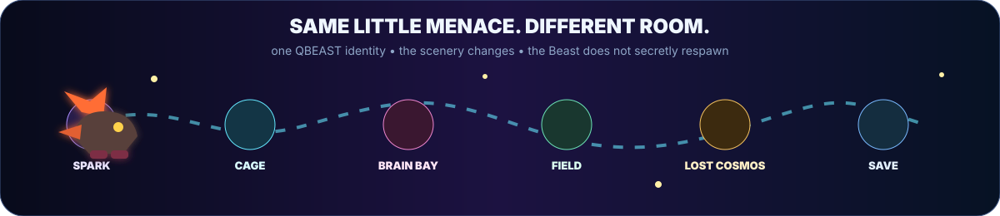
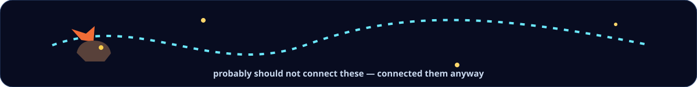

<div align="center">


# CORY SHANE DAVIS // NAVISWORLD

### 🐉 BEAST BOX • 🌌 COSMOS • ⚛️ COSMIC SYNAPSE THEORY • 🎮 LOST COSMOS • 🧠 LOCAL AI • 🛰️ SYNAPSE OS

**I build weird little machines until they start talking to each other — persistent software creatures, local AI, games, simulations, devices, art, music, research, and whatever else I probably should not have connected.**

[](https://www.beastboxcosmos.xyz)
[](https://github.com/NavisWORLD/The-beast-box-)
[](https://github.com/sponsors/NavisWORLD)
[](https://buymeacoffee.com/Cosmic_syanpse)

### ✦ BUILD STRANGE • MEASURE HARD • LEAVE A MAP ✦

</div>

---

## 🌌 Welcome to the weird part of GitHub

Welcome to the weird part of GitHub.

This is basically my digital garage if the garage had a Game Boy, a tiny dragon, several AI models, quantum receipts, an operating system experiment, too many wires, and absolutely no adult supervision.

I build things that usually begin with:

> **Okay, but what if these systems were actually connected?**

The flagship is **[Beast Box](https://github.com/NavisWORLD/The-beast-box-)**: a local-first software ecosystem for persistent digital companions. The creature carries identity and state outside the inference model so the model can change without automatically erasing the creature's continuity.

**The short version:**

> **MODEL ≠ MEMORY ≠ STATE ≠ AUTHORITY**

A Beast can use a model. A Beast is not the model.

<div align="center">

### 🐉 [OPEN THE LIVE BEAST BOX →](https://www.beastboxcosmos.xyz)

**CREATE → SEE → HEAR → INTERACT → TALK → SIMULATE → EVOLVE → EXPLORE → PERSIST**

</div>

---

## 🐉 Same Beast. Different Worlds.


**ONE CREATURE • MANY BRAINS • MANY WORLDS • CONTINUOUS IDENTITY**

The creature is the continuity object. The surfaces are rooms it can visit.

```text
CREATURE
│
├── identity + family
├── traits + stats
├── memory references
├── evolution state
├── environment + save state
├── QBEAST metadata / provenance
│
└── MODEL SLOT
      ├── RAWRPHØS / local research paths
      ├── local models
      └── supported external provider adapters

BEAST → BEAST CAGE → BRAIN BAY → LOST COSMOS → EXPORT / SAVE / DEVICE
```

**State may travel. Information may travel. Authority does not travel automatically.**

That boundary is not lore. It is the engineering rule.



*Same little menace. Different room.*

---

## 🛠️ The workshop where I keep connecting things I probably shouldn't

### 🛠️ Builder desk

The boring machinery is part of the magic:

`git` • source history • tests • CI • local development • reproducible artifacts • receipts • failed runs kept when they teach something

**Rule:** build → instrument → test → preserve → connect → teach → ship.

### 🐉 Meanwhile, across the room...

The creative layer is allowed to be ridiculous.

The technical layer still has to answer:

- what state exists,
- where it lives,
- who may change it,
- what was measured,
- what was simulated,
- and which receipt proves the sentence.

So yes: **tiny dragon, glowing crystals, Game Boy shrine.**  
Also yes: **tests, provenance, permissions, and failure receipts.**



> **probably should not connect these — connected them anyway**

---

## 👹 Okay... so what the hell is Beast Box?

**Beast Box** is the place where the separate threads become one product surface:

Think of Beast Box less like six apps and more like **rooms in the same extremely weird house**.

### 🐉 Beast Cage — *home*
Creature body, visual state, habitat, care and interaction.

### 🧠 Brain Bay — *the brain slot*
Connects the creature to supported local/native/external inference paths **without making the model the identity**.

### 🎮 Lost COSMOS — *the adventure*
A game surface where a serialized creature becomes a playable snapshot while keeping its lineage.

### 🧬 Genesis / Spark — *birth*
Seeded creature creation, traits, stats, visuals and provenance-aware generation.

### 💾 Persistence — *the part I refuse to lose*
Save/load, memory references, lineage, serialized state and recovery.

### 🪽 Sensory / device experiments — *because apparently the browser wasn't enough*
Permission-controlled sensing and future companion-device surfaces.

**[Source →](https://github.com/NavisWORLD/The-beast-box-)** ·
**[Live experience →](https://www.beastboxcosmos.xyz)**

---

## 🌱 I apparently made a model garden


I did not need a shelf of computational familiars. This did not stop me.

The garden is intentionally honest about status. A name, adapter, checkpoint or research artifact does not magically turn every identity into an equally capable production model.

- **RAWRPHØS** — native/local research line documented inside the Beast Box ecosystem.
- **PHOS** — NavisWORLD research model identity; artifacts do not imply production readiness.
- **SAMGO** — NavisWORLD model-family identity.
- **MUSE** — model/assistant identity; separate from the **Muse EEG/headband connector** discussed elsewhere.
- **SOL** — ecosystem model/assistant identity; capability claims stay scoped to the actual artifact using the name.

None of those labels assigns PHOS or SAMGO to another company.

---

## 🎮 Then I put the little fucker in a Game Boy


### Same Beast. Now it has a save file. 💀

Lost COSMOS is the game-facing side of the ecosystem.

The captured interface shows **Cogfist II / Rust Meridian** with `SPARK` movement, generated gait/reaction parameters, a local-model option and a recorded-run pointer.

The input panel is explicitly labeled **SIMULATED MUSE SIGNAL**. It is not a live EEG measurement in this capture.

**yes, it actually has save data**

<details>
<summary><b>🗺️ Open a supplied 12-creature atlas</b></summary>
<br/>

<br/><br/>
The poster is a supplied project artifact. Its rarity labels and body-plan labels are presented as part of that artifact rather than independently re-derived here.
</details>

---

## 📡 Yes, the creature has stats. Of course it does.


I gave the pixel creature telemetry because of course I did. 😭

This card is **EXAMPLE CREATURE TELEMETRY**, reconstructed from a supplied UI capture — not a public live endpoint.

The important pattern is less flashy than the bars:

> **displayed state should always say where it came from.**

If the source is simulated, say simulated. If it is seeded, say seeded. If it is measured, keep the receipt that makes *measured* a defensible word.

---

## ⚛️ This is where the actual research lives

### ⚛️ Cosmic Synapse Theory

This is the shelf where I stop making Game Boy jokes for a minute and show the math.

CST is the research shelf: recurrence, coupling, compact computational state, memory, signal, association, perturbation, ablation and falsifiable software experiments.

I use **12D** as computational-state notation in parts of this work. That is a description of a software state vector unless a separate experiment establishes something more.

<details>
<summary><b>🔬 SCIENTIFIC BOUNDARY // LIGHTS ON</b></summary>
<br/>

A computational `12D` state does **not** by itself prove twelve physical dimensions, consciousness, a neural universe, or a new law of physics.

Continuity does **not** establish consciousness.

Visualization does **not** establish an experiment.

Seeded generation does **not** become a hardware measurement because the UI looks quantum.

The software can be real while a broader interpretation remains a hypothesis.

</details>

**[CST origin →](https://github.com/NavisWORLD/The-theory-of-CST)** ·
**[Deposited record →](https://doi.org/10.5281/zenodo.17574447)**

---

## 🧪 Quantum stuff — with the labels left on

Yes, the word **quantum** is on my GitHub. No, I am not using it as glitter. 💀

The bench has four labeled drawers because mixing them destroys trust.

| Label | Meaning |
|---|---|
| **SIMULATOR** | Classical simulator output, including QVM-style workflows. |
| **SEEDED** | Deterministic/pseudorandom input or a fixed recorded artifact reused as a seed. |
| **MEASURED** | A stored measurement artifact whose provider/backend/run context is preserved. |
| **HARDWARE / QPU** | Claimed only when the receipt actually identifies a hardware backend/job and the measurement record is retained. |

Recorded measurement outcomes become ordinary classical data once stored. They can seed software; they do not create an ongoing entanglement or live quantum link to a creature.

**null results live here too**

---

## 🛰️ And then I started trying to put it in everything

At some point I looked at the browser and thought: **why should the Beast have to stay in there?**

This is how these problems start.

The creature should not be trapped in one webpage.

Current and future-facing surfaces include browser/local runtime work, **[Synapse OS](https://github.com/NavisWORLD/Synapse-os-)**, native GBA/game-pack work, and device concepts.

The safe device idea is intentionally boring under the magic:

```text
WATCH / HANDHELD / PUCK
        │
        │ small public snapshot + input events
        ▼
PHONE / LOCAL HOST
        │
        ├── creature ledger + save
        ├── policy / permissions
        └── optional model inference
```

A watch can render the creature, display status, accept taps and send bounded events without storing the whole memory vault or model. That makes the *same companion on a watch* plausible without pretending the watch contains the entire Beast Box.

**Custom hardware remains a concept until a real prototype earns stronger language.**

---

## 📻 What I'm actually building right now

```text
FLAGSHIP     Beast Box
CREATURE     Spark Beast / QBEAST identity
GAME         Lost COSMOS
RESEARCH     CST
NATIVE LINE  RAWRPHØS
STATE        persistent / portable
OS TRACK     Synapse OS
METHOD       build → instrument → test → preserve
MISSION      connect weird systems without lying about the seams
```

The product direction is companion-first, world-second: continuity across surfaces is the thing worth protecting. The broader plan treats model memory and creature identity as separate concerns.

*Translation: I am trying to make one tiny creature survive my terrible habit of putting it in increasingly unreasonable places.*

---

## 🌌 The rest of the universe


Turns out “one weird side project” became a whole constellation. Who could have predicted this. *(Me. Eventually.)*

- 🐉 **[THE BEAST BOX](https://github.com/NavisWORLD/The-beast-box-)** — persistent creatures, Beast Cage, Brain Bay, Lost COSMOS, model integration, persistence, simulation and exports.
- 🌌 **[COSMOS](https://github.com/NavisWORLD/Cosmos)** — local-first runtime engineering around state, tools, memory, evaluation and portable intelligence.
- ⚛️ **[COSMIC SYNAPSE THEORY](https://github.com/NavisWORLD/The-theory-of-CST)** — recurrence, coupling, computational state, association, simulation and falsifiable experiments.
- 💻 **[SYNAPSE OS](https://github.com/NavisWORLD/Synapse-os-)** — OS-level experiments bringing local AI and Beast Box concepts closer to the machine.
- 🎵 **[REALITY BRIDGE / ALIEN CONDUCTOR](https://github.com/NavisWORLD/-reality-bridge-alien-conductor-local-ai-band)** — realtime music, adaptive accompaniment and shared musical state.
- 🪐 **[LIVING UNIVERSE](https://github.com/NavisWORLD/Cosmic-synapse-the-living-universe-sim-engine-)** — world-state, simulation, visualization and interactive CST-inspired systems.
- 🧬 **[PYTHON CST LIBRARIES](https://github.com/NavisWORLD/Python-cst-libraries-)** — reusable state, simulation and CST engineering primitives.
- 📖 **[COSMOS / CST MANUAL](https://github.com/NavisWORLD/Volume-I-The-COSMOS-CST-Universe-Manual.)** — public theory maps, engineering notes, education and documentation.
- 🎨 **[COSMOS MEDIA](https://github.com/NavisWORLD/Cosmic-quantum-video-picture-generator-)** — image, video, storybook continuity and generative-media experiments.
- 🫀 **[HEARTLIGHT](https://github.com/NavisWORLD/COSMOS-HEARTLIGHT)** — accessibility-oriented and human-centered technology experiments.

<div align="center">

### [ENTER THE FULL REPOSITORY UNIVERSE →](https://github.com/NavisWORLD?tab=repositories)

</div>

---

## 🧠 Cory.exe


### 🧍 Me, approximately

```text
NAME       Cory Shane Davis
HANDLE     NavisWORLD

MODE       creator / builder
           independent researcher

MATERIAL   code • games • models
           electronics • music
           art • writing • experiments

RULE       curiosity > certainty
```

### 🧪 The rules taped to the wall

```text
measure what matters
keep the failed receipt
separate model from state
separate state from authority
make it understandable
make it strange anyway
```

<details>
<summary><b>🧪 Open creator mode</b></summary>

```python
while curiosity:
    artifact = build(ask_the_question_no_one_asked())
    instrument(artifact)
    test(artifact)

    preserve(
        wins=True,
        failures=True,
        null_results=True,
        receipts=True,
    )

    connect(artifact, to="the rest of the universe")
    teach(what_we_learned)
    ship(what_is_real)
```

</details>

---

## 🐉 Feed the Beast

I somehow made the dragon require server bills. Incredible.


<div align="center">

### 💖 [GITHUB SPONSORS](https://github.com/sponsors/NavisWORLD)
### ☕ [BUY ME A COFFEE](https://buymeacoffee.com/Cosmic_syanpse)

**Support adds:** hosting · compute · hardware · storage · experiments · documentation · prototype parts · development time

**No fake counters. No fake scarcity. No pretending sponsorship buys scientific truth.**

*Support is optional. Curiosity is free. The Beast remains suspiciously hungry.*

</div>

---

## 📜 Yes, the boring legal stuff matters

The magic is more fun when everybody knows what they can actually use.

Original Cory-owned content published with the [Apache-2.0 LICENSE](LICENSE) is available under that license except where files, repositories, model weights, datasets, artwork or third-party dependencies state otherwise.

**[Open-source scope →](OPEN_SOURCE_SCOPE.md)** ·
**[Verified ecosystem licensing inventory →](OPEN_SOURCE_ECOSYSTEM.md)**

The profile itself is a map, not a relicensing machine. Individual repositories and artifacts keep their own stated terms.

---

## ✨ Okay, that's the tour

<div align="center">


# THE UNIVERSE IS THE SOFTWARE.
## WE JUST WRITE BETTER INTERFACES.

**For the dreamers.**  
**For the idlers.**  
**For the players.**  
**For the builders.**  
**For the researchers.**  
**For anybody curious enough to press the glowing button.**

🌌 🐉 ⚛️ 🎮 🧠 🛰️ ❤️

### CORY SHANE DAVIS // NAVISWORLD

[BEAST BOX](https://www.beastboxcosmos.xyz) •
[SOURCE](https://github.com/NavisWORLD/The-beast-box-) •
[GITHUB SPONSORS](https://github.com/sponsors/NavisWORLD) •
[BUY ME A COFFEE](https://buymeacoffee.com/Cosmic_syanpse) •
[ALL REPOSITORIES](https://github.com/NavisWORLD?tab=repositories)

</div>